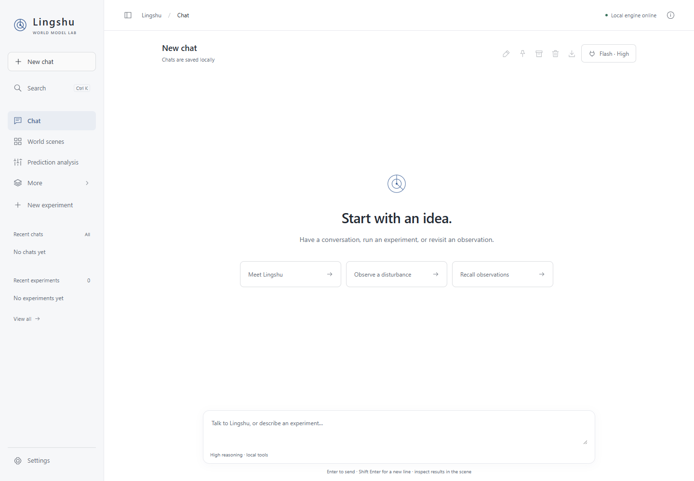

# Lingshu Desktop Agent

[简体中文](README.md) | English

Start with an idea. A local Windows workbench that brings together DeepSeek Harness conversations, Lingshu world-model experiments, replay and isolated memory.

**Current version: 0.0.2 Windows preview.** Download the ZIP and SHA-256 checksum from the [GitHub Release](https://github.com/shenA2024/lingshu-desktop-agent/releases/tag/v0.0.2). See the [changelog](CHANGELOG.md) for changes.



## Features

- Real model conversations, session continuation, stopping and inspectable tool results.
- Pin, archive and restore chats; filter and search history; rename, export and delete app records.
- Six built-in experiment and memory tools, plus user-managed stdio and Streamable HTTP MCP connections. Check a service and inspect its tools before enabling it.
- Three deterministic scenes: pursuit, disturbance and avoidance, with replay, prediction verification and anomaly inspection.
- Isolated experiment memory with searchable summaries and notes.
- English and Chinese interfaces, language selection for the next model turn, adjustable base text size from 12 to 20, and light, dark and warm themes.
- Keyboard-accessible dropdowns with selected indicators, typeahead, viewport placement and short transitions that respect reduced motion.
- ZIP backups of visible chats, tool records, experiment trajectories and notes, with SHA-256 manifests. Restored chat history is read-only.

## Install and run

Requirements: Windows, Python 3.13 and PowerShell. Chat requires **DeepSeek Harness 0.2.0-rc.2** and usable model credentials. Manual experiments need no model key. Initial setup downloads the locked external dependencies.

```powershell
git clone https://github.com/shenA2024/lingshu-desktop-agent.git
cd lingshu-desktop-agent
.\setup.ps1 -Python python
.\start.ps1 -Desktop
```

You can also use the bundled `.cmd` launchers. The app is a Python local service with a browser or Edge app window, not a standalone EXE installer. It binds to `http://127.0.0.1:8787` by default. Stop it with `.\stop.ps1`.

To upgrade from 0.0.1, stop the service, copy the new program files into the existing app directory while preserving `data/`, then run the installation and launch scripts. Existing chats, experiments and model settings remain available. You can download a visible-data backup under Settings → General before upgrading.

Set the installed Harness executable in Model settings. Models offered are DeepSeek Flash and V4 Pro, with High or Maximum reasoning. The real integration check used Flash / High. Other runtime versions and model providers are not verified.

Choose English and font size in **Settings → General**. Language changes UI labels and the next response's language. Your existing messages, notes, code and tool output remain in their original language.

## Tools and data

Under **Connections → General tools · MCP**, add a server, save, check its connection, then enable it. The next turn uses the enabled tool configuration. Editing requires a new check. See [MCP connections](docs/MCP_CONNECTIONS.md) for transport, credential and lifecycle details.

API keys and MCP environment/header values use Windows user-scoped DPAPI encryption. Saved credentials are not returned to the browser or included in Git, release packages or visible-data backups. Avoid putting secrets in commands, arguments or URLs. External tools may provide filesystem or network access; configure each server's own access scope. This app does not create a universal filesystem sandbox for external MCP servers.

Data lives in `data/`. Override it with `LINGSHU_WORKBENCH_DATA`; change the port with `LINGSHU_WORKBENCH_PORT`. The app uses its own Harness home and workspace. It does not import your existing Harness persona, sessions or personal memory.

Stopping a turn closes its local process tree and requests cancellation of its owned experiments. A turn lasts at most 10 minutes, with at most three simultaneous chats. Connection checks have a 20-second deadline, and external tool calls a 60-second deadline. Remote HTTP cancellation depends on the server.

Backups preserve visible chats, tool records, experiments and notes. They exclude credentials, tool connection settings, raw Harness sessions and reasoning logs, dependency caches and browser preferences. Visible tool output may contain data supplied by your external services. Restore to a new directory:

```powershell
.\.venv\Scripts\python.exe -X utf8 .\data_backup.py "backup.zip" --destination "D:\LingshuRestoredData"
```

The destination must not exist. Restored chat history can be inspected and exported; start a new chat to continue working.

## Current scope

Lingshu is a working local Agent workbench, with a smaller scope than general development or office Agent applications. It does not yet include a plugin marketplace, agent teams, full SillyTavern integration, a built-in general file editor, or a standalone EXE installer. See the [feature comparison and roadmap](docs/FEATURE_RESEARCH.md).

Prediction hits mean `distance < bound`. Bound coverage does not measure general intelligence or exact next-position accuracy. Graph relations represent accumulated historical inference. See the [metric notes](static/metric-notes.html?lang=en).

## Development

```powershell
.\setup.ps1 -Dev -Python python
.\.venv\Scripts\python.exe -X utf8 -m unittest discover -s tests -v
python .\scripts\build_release.py
python .\scripts\build_release.py --verify
```

Backend regression, local browser validation and real Harness evidence are described in [VALIDATION.md](VALIDATION.md). Installed-Harness integration tests skip when the supported runtime is unavailable; fixtures are explicitly identified.

This community-maintained workbench builds on [Lingshu](https://github.com/FuRongJun-1999/lingshu), [dsh-memory](https://github.com/FuRongJun-1999/dsh-memory) and [DeepSeek Harness](https://github.com/deepseek-ai/deepseek-harness). MIT license; see [third-party notices](THIRD_PARTY.md).
