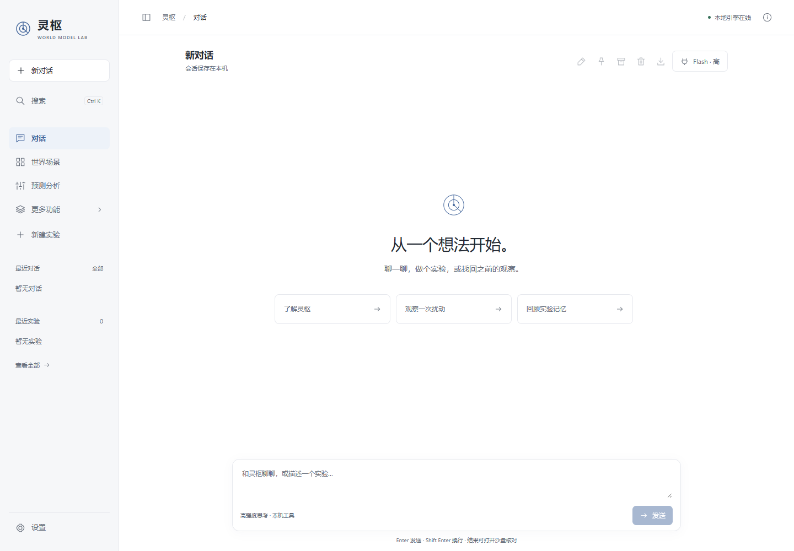
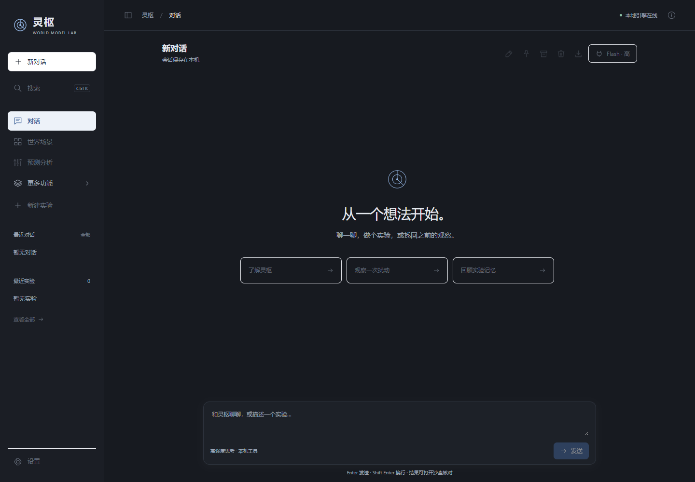

# 灵枢桌面 Agent

简体中文 | [English](README.en.md)

[](https://github.com/shenA2024/lingshu-desktop-agent/actions/workflows/checks.yml)
[](LICENSE)
[](https://github.com/shenA2024/lingshu-desktop-agent/releases/tag/v0.0.2)

从一个想法开始。一个简洁的 Windows 本地工作台，把 DeepSeek Harness 对话、灵枢世界模型实验、逐步回放和独立记忆放在同一界面。

**当前版本：0.0.2 Windows 体验版。** 下载与更新记录见 [GitHub Release](https://github.com/shenA2024/lingshu-desktop-agent/releases/tag/v0.0.2) 和 [CHANGELOG](CHANGELOG.md)。本项目由社区维护，基于 [Lingshu](https://github.com/FuRongJun-1999/lingshu)、[dsh-memory](https://github.com/FuRongJun-1999/dsh-memory) 和本机 [DeepSeek Harness](https://github.com/deepseek-ai/deepseek-harness)，是独立的桌面工作台项目。



## 可以做什么

- **对话连接行动**：真实模型可调用六个实验与记忆工具，运行实验、查询结果、召回摘要。
- **通用工具可接入**：管理 stdio / Streamable HTTP MCP 服务，实际检查连接与工具列表，启用后供模型调用。详见 [接入说明](docs/MCP_CONNECTIONS.md)。
- **实验可以回看**：追逐、外部扰动、避让三个预设场景；逐步观察、预测验证、异常定位、关系图和执行记录。
- **观察留下线索**：独立实验记忆库，支持自动摘要、检索和手动笔记。
- **会话便于整理**：续聊、停止、置顶、归档、恢复、分类与正文搜索、重命名、删除应用记录、导出和重启后的历史恢复。
- **界面适合习惯**：中英文即时切换、12–20 基础字号调节、键盘可用的动态下拉菜单；白天、夜晚、暖色主题；欢迎区居中，快捷入口等宽，侧栏与实验功能可按需显示。
- **数据可以备份**：会话、实验轨迹和记忆笔记打包为 ZIP，带 SHA-256 清单；恢复到新目录后，会话历史只读。

## 下载与安装

[下载 0.0.2 体验包](https://github.com/shenA2024/lingshu-desktop-agent/releases/tag/v0.0.2)，解压到自己的应用目录。Release 同时提供 ZIP 和 SHA-256 校验文件。

环境要求：Windows、**Python 3.13**、PowerShell；对话功能还需要已安装的 **DeepSeek Harness 0.2.0-rc.2** 及可用的模型凭据。手动实验无需模型。首次安装需联网下载锁定的依赖。

1. 双击 `首次安装.cmd`。
2. 双击 `启动灵枢.cmd`，以 Edge 应用窗口打开；系统未安装 Edge 时使用默认浏览器。
3. 在对话右上角的模型设置填写自己的 Harness 可执行文件位置。
4. 安装或启动异常时，运行 `检查环境.cmd`；此检查不会发起模型请求。

从 0.0.1 升级时，先停止服务，将新版本程序文件覆盖到原目录，保留原来的 `data/`，再运行 `首次安装.cmd` 和 `启动灵枢.cmd`。旧对话、实验和模型设置继续使用；升级前可在「设置 → 通用」下载可见数据备份。

当前是 **Python 本地服务 + 浏览器界面**，尚无独立 EXE 安装器。默认地址是 <http://127.0.0.1:8787>。

从源码运行：

```powershell
git clone https://github.com/shenA2024/lingshu-desktop-agent.git
cd lingshu-desktop-agent
.\setup.ps1 -Python python
.\start.ps1 -Desktop
```

停止服务：

```powershell
.\stop.ps1
```

`setup.ps1` 创建 `.venv` 并安装固定依赖。`start.ps1 -NoBrowser` 仅启动服务；`start.ps1 -Python '<Python可执行文件路径>'` 可选择已安装依赖的 Python。脚本核对本目录服务身份。

## 第一次体验

试着输入：

> 运行一次 18 步外部扰动实验，查询完成后解释变化，再召回摘要。

展开工具记录可以检查实际参数与结果，点击“打开实验沙盘”进入同一次实验的回放与分析。

也可点击“新建实验”手动运行预设场景。每步实际路径为 `generate(horizon=1) → step(1) → perceive() → verify()`。备注用于记录；实验摘要保存到独立记忆库。



## 模型与数据

模型选项提供 DeepSeek Flash / V4 Pro，高或最高推理强度，支持 Harness `0.2.0-rc.2`。已完成的真实模型链路验收使用 DeepSeek Flash、高强度。检测到其他 Harness 版本时会提示原因，不启动模型会话；其他供应商与账号登录型路由尚未验证。

凭据可来自独立保存的 API 密钥、启动环境变量 `DEEPSEEK_API_KEY`，或本机 Harness 的同名引用。独立密钥以 Windows 用户级 DPAPI 加密保存在本地，不返回浏览器，不进入发布包。应用不迁移本机 Harness 的原有会话、人格或记忆；应用使用独立的运行时目录。

成功连接验证绑定当前模型、强度、运行时、凭据修订与启用的工具配置。切换配置后会重新标记为待验证；环境检查通过不等于网络与账号额度可用。

应用数据默认在 `data/`。可用 `LINGSHU_WORKBENCH_DATA` 指定独立数据目录，`LINGSHU_WORKBENCH_PORT` 指定端口。Git 和发布脚本排除本地数据、凭据、运行时会话与缓存。

停止对话会关闭本轮 Harness 进程树，并请求停止本轮已启动且仍运行的实验；实验创建时即登记归属，停止后的迟到创建请求会被拒绝。单轮最长 10 分钟，同会话互斥，同时最多 3 个会话。

## 备份与恢复

在「设置 → 通用 → 下载备份」保存可见的会话、工具记录、实验轨迹和记忆笔记。先完成或停止运行中的任务。备份包含自己的对话内容，不包含密钥、账号凭据、工具连接设置、Harness 原始会话与推理日志、依赖缓存或浏览器偏好。

```powershell
.\.venv\Scripts\python.exe -X utf8 .\data_backup.py "备份.zip" --destination "D:\灵枢恢复数据"
```

目标目录必须尚不存在。恢复后的会话历史可查看、搜索和导出，继续工作请新建对话；实验可回放，记忆可召回。详见 [备份与恢复](static/backup-help.html)。删除对话只清理应用聊天记录，关联实验、记忆和 Harness 原始会话保留。

## 当前范围

默认提供文字对话及六个本地工具：`lingshu_list_scenarios`、`lingshu_run_scene`、`lingshu_get_run`、`lingshu_cancel_run`、`lingshu_recall`、`lingshu_remember`。用户可显式接入通用 MCP，能力和访问范围取决于对应服务。没有内置通用文件编辑器、插件市场、智能体团队或完整酒馆接入；实验采用三个确定性预设场景，观测携带实体标识。外部 MCP 尚无统一文件沙箱。

对 Harness、ZCode、Codex、WorkBuddy、VS Code、酒馆与 TUI 的核实结果和路线见 [功能参考](docs/FEATURE_RESEARCH.md)。

预测命中表示 `distance < bound`，边界覆盖命中不能解读为通用智能水平或准确猜中位置。历史关系图显示历史观测。详见 [指标说明](static/metric-notes.html)。模型文字需结合真实工具结果核对。

## 开发与验证

```powershell
.\setup.ps1 -Dev -Python python
.\.venv\Scripts\python.exe -X utf8 -m unittest discover -s tests -v
python .\scripts\build_release.py
```

0.0.2 已通过本地 37 项后端检查、20 组浏览器检查及 7 项补充界面检查，并完成真实模型调用外部 MCP 和英文续聊。旧版本的 70 项浏览器检查和 2683 项配色检查保留为历史记录。协议夹具与真实模型验收分开记录；自动测试不会发送模型请求。GitHub Actions 在 Windows / Python 3.13 上运行回归、JavaScript 语法与发布包完整性检查；未安装 Harness 时跳过 3 项运行时集成检查。

安装包由显式白名单生成于 `dist/`，包含 SHA-256 文件和逐文件清单。参见 [验证记录](VALIDATION.md)、[Harness 集成](DSH_INTEGRATION.md)、[贡献说明](CONTRIBUTING.md) 与 [版本规则](VERSIONING.md)。日常迭代只递增最后一位。

## 许可证与上游

工作台源码采用 [MIT License](LICENSE)。Lingshu 和 dsh-memory 固定官方提交及归档摘要，首次安装到项目之外；上游版权声明与 MIT 文本保留于 [licenses/](licenses)。DeepSeek Harness 通过本机已安装 CLI 调用，不随本项目分发其程序、界面或图标。

完整来源与版本见 [THIRD_PARTY.md](THIRD_PARTY.md)。
